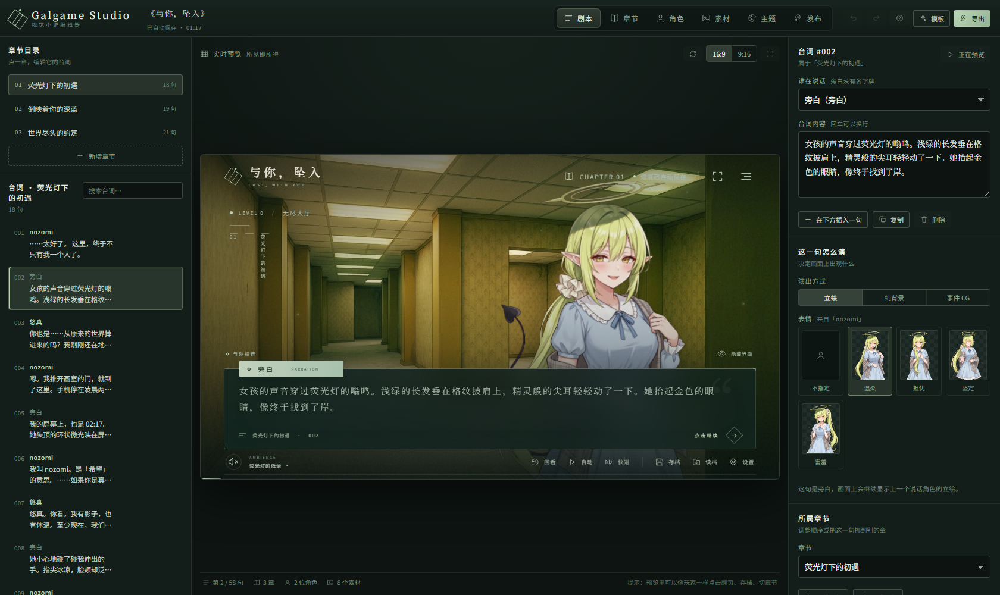
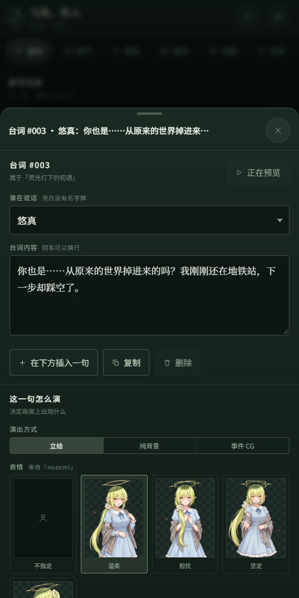
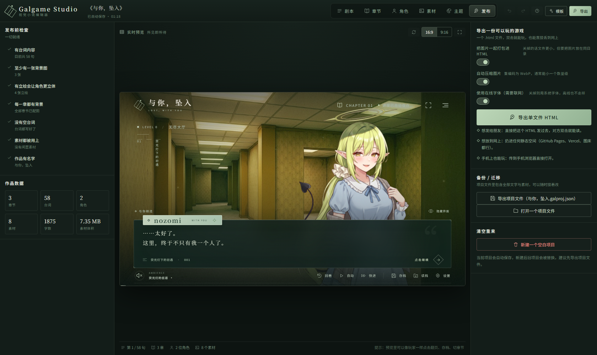
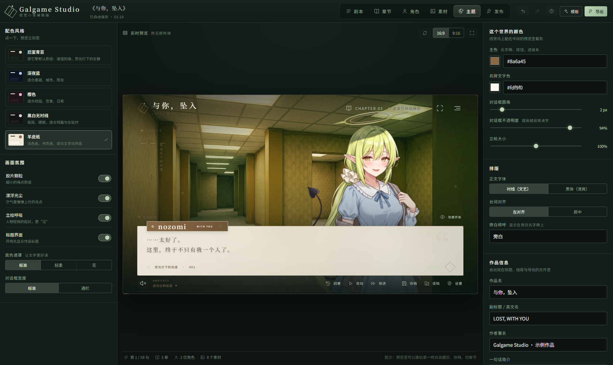
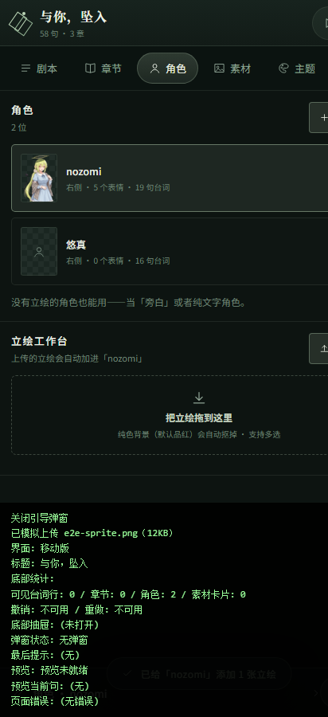

# Galgame Studio · 视觉小说编辑器

所有项目全部由Astra大人与蓝色大肥鱼完成（包括此界面）
本编辑器目前仅支持中文界面。

## 下载

- [安卓安装包](https://github.com/i4EXD/galgame-studio/releases/download/v1.1.0/GalgameStudio-1.1.0-release.apk)：支持 Android 10 及以上。
- [电脑离线版](https://github.com/i4EXD/galgame-studio/releases/download/v1.1.0/GalgameStudio-1.1.0-PC.html)：下载后使用 Edge 或 Chrome 打开。
- [完整源码与原始美术素材](https://github.com/i4EXD/galgame-studio/archive/refs/heads/main.zip)。
- [版本说明与全部下载文件](https://github.com/i4EXD/galgame-studio/releases/tag/v1.1.0)。

## 1.1.0 新增

- 批量导入台词：剧本列表底部可粘贴多行文本，每行生成一句；支持 `角色名：台词` 和 `旁白：台词`，一次撤销即可恢复。
- 复制整章：章节详情中复制场景设置与全部台词，新章节插在原章后，可独立编辑。
- 三套美术模板：海风来信、雨夜霓虹、冬日书店，内含生成的场景图、配色与 6 句开场剧本；桌面「模板」与手机「更多 → 换一个模板」均可选择。
- 三套主题也可在「主题」页直接应用于已有作品。
- 安装包：`dist-android/GalgameStudio-1.1.0-release.apk`，支持 Android 10 及以上。

验证：`npm test`；构建后可运行 `node tools/_test-browser.mjs` 检查桌面与手机模板预览。
美术源文件及生成提示词说明位于 `assets-src/templates/README.md`。

> 从一部完整的 galgame（《与你，坠入》· 后室恋爱视觉小说）里把**引擎和 UI 风格**整个拆出来，
> 做成一个**不需要写代码**的编辑器：写台词、传立绘、选背景、点导出——就得到一部能发给任何人玩的 galgame。

同一个引擎有两个外壳：**电脑上的编辑器**（单文件 HTML，双击即用）和**手机上的 App**（Android APK，编辑器 + 书架）。




---

## 一、30 秒上手

### 方式 A：双击打开（最简单）

```
双击 dist/index.html
```

编辑器会直接在你的浏览器里跑起来（单文件约 2 MB，不依赖任何外部文件），示例作品《与你，坠入》已经装好，
点「开始阅读」就能玩，改文字改图立刻生效。

> 推荐用 Chrome / Edge。项目会自动保存在浏览器里，下次打开还在，导出功能也完全离线可用。

### 方式 B：装到手机上（Android APK）

```
dist-android/GalgameStudio-1.1.0-release.apk     ← 8.7 MB，已签名，直接装
```

传到手机点安装即可（需要允许「安装未知来源应用」）。手机上打开就是**移动版编辑器**：
页签在顶部、点一条台词从底部弹出编辑面板、右上角 ▶ 全屏试玩、「发布」里导出的作品会同时进
**「我的书架」**和手机的**「下载/GalgameStudio」**目录。详见 [第七节](#七手机版android-app)。

### 方式 C：本地服务器（开发用）

```bash
npm install
npm run dev          # 开发模式，改代码热更新：http://localhost:5199
npm run build        # 打包出 dist/index.html（单文件，约 2 MB）
npm run check        # 类型检查 + 构建
```

### 方式 C：只想拿成品

```
双击 dist/index.html → 右栏「发布」→ 导出单文件 HTML
```

得到一个 `作品名.html`（示例作品约 1.6 MB），**双击就能玩，发给谁都能玩，丢到任何静态托管都能跑**。



---

## 二、三步做一部自己的 galgame

### 第 1 步：改台词

左侧「剧本」视图 → 点任意一句 → 右侧改**说话人**和**台词内容**。

- 说话人选「旁白」就没有名字牌，适合写场景和心理描写
- 台词里回车可以换行
- 一行里的「演出方式」决定这一句画面上出现什么：**立绘** / **纯背景** / **事件 CG**
- 想加新台词：底部的「在这一章末尾添加台词」；想插到中间：右侧的「在下方插入一句」
- 台词可以上移下移、复制、删除，也可以整句挪到别的章节

### 第 2 步：配上画面

| 想做什么 | 去哪里 | 怎么做 |
| --- | --- | --- |
| 加背景图 | 「素材」视图 | 把图片**拖进**左上角的虚线框 |
| 给章节指定背景 | 「章节」视图 | 选中章节 → 章节背景图 → 选一张 |
| 加人物立绘 | 「角色」视图 | 选中角色 → 「上传立绘」→ 传多张不同表情 |
| 自动去掉立绘背景 | 「角色」视图 | 表情行里的「自动去背景」默认开着，纯色背景会被抠掉 |
| 加全屏插画 | 「素材」视图 | 导入时分类选「事件 CG」，再在台词里选「事件 CG」 |
| 加氛围色 | 「章节」视图 | 选一个颜色 + 强度，画面会蒙上一层柔光 |

### 第 3 步：导出

右栏「发布」→ **导出单文件 HTML**。

导出前编辑器会自动帮你检查：有没有空台词、哪一章忘了配背景、有没有闲置素材。
导出的默认还会把图片重编码成 WebP，把 10 MB 的示例压到 1.6 MB，画质几乎不变。

想备份或换电脑继续做：同一页的「导出项目文件」会生成 `作品名.galproj.json`（含全部文字与素材），
在新机器上「打开一个项目文件」即可接着改。

---

## 三、六个视图都在干什么

| 视图 | 左边 | 右边 |
| --- | --- | --- |
| **剧本** | 章节筛选 + 台词列表 | 选中台词的说话人 / 文本 / 表情 / 演出方式 |
| **章节** | 章节目录（带封面） | 章节编号、标题、副标题、简介、LEVEL、地点、背景、氛围色、环境音 |
| **角色** | 角色列表 | 名字、英文名、站位（左/中/右）、表情立绘（抠图强度可调） |
| **素材** | 素材网格（分类 / 拖拽导入） | 大图预览、改名、分类、查看被哪些地方引用 |
| **主题** | 5 套配色 + 氛围开关 | 主色、圆角、对话框不透明度、立绘大小、字体、对齐、作品信息、结局文案 |
| **发布** | 发布前检查 + 作品数据 | 导出 HTML / 导出项目文件 / 打开项目文件 / 重新开始 |

中间永远是**实时预览**：就是玩家看到的那一屏，可以直接点着翻页、存档、切章节、试主题。



快捷键：`Ctrl+1~6` 切视图，`Ctrl+Z` 撤销（60 步），`Ctrl+Shift+Z` 重做，`Ctrl+S` 立即保存。

一次「上传立绘」算一步：导入素材和分配表情会被合并成同一条历史，`Ctrl+Z` 一次就能整条撤回。

---

## 四、素材建议

| 类型 | 建议尺寸 | 说明 |
| --- | --- | --- |
| 背景 | 1280×720 或更宽（16:9） | 横向构图，人物一般站右侧 |
| 立绘 | 竖构图，高 1000~1500 | 人物居中、**纯色背景**（默认品红 `#ff00ff`），上传后自动抠图 |
| 事件 CG | 同背景尺寸 | 用在表白、转折这类重要场面 |
| 音频 | mp3 / ogg | 可选；不传音频也有合成环境音 |

抠图用的是「**色相投影 + 去溢色**」算法（见 `src/player/runtime.js` 的 `chromaKey`）：
灰白黑一定保留，只有与背景同色系的像素才透明，所以白裙子、浅色头发不会被误伤。
如果角色身上有和背景一模一样的颜色，打开「仅抠边缘」就只清掉与画面边缘相连的部分。

---

## 五、引擎做了什么（扒出来的功能清单）

例子里的引擎能力被完整保留并泛化成「任意项目都能用」：

**阅读体验**
- 逐字打字机（速度可调）、点击 / 空格 / 回车 / → 继续、← 回上一句
- 自动播放（间隔可调）、快进、隐藏界面（H）、全屏
- 章节标题入场动画、章节指示器、进度条、场景交叉淡入

**演出**
- 立绘：多角色、多表情、呼吸动画、说话高亮、左侧/中间/右侧站位
- 自动去背景（可调颜色与强度、可只抠边缘）
- 事件 CG 全屏演出、章节氛围色叠加、胶片颗粒、漂浮光尘、底色遮罩

**系统**
- 存档 / 读档（槽位数量可配，带缩略图）、历史回看（可跳回任意一句）
- 章节回廊（进度解锁）、结局页、标题页、设置面板
- Web Audio 合成环境音（不传素材也有氛围音），也可以换成上传的音频
- 键盘导航 + 无障碍属性（aria）齐全

**换肤**
- 5 套预设配色（后室青苔 / 深夜蓝 / 樱色 / 黑白 / 羊皮纸）+ 全量自定义变量
- 字体、圆角、对话框不透明度、立绘缩放、对齐方式、是否存在光尘与颗粒

---

## 六、工程结构

```
src/
├── player/
│   ├── runtime.js      ★ 播放器运行时（纯 JS，无依赖，编辑器预览与导出产物共用同一份）
│   ├── base.css        ★ 原引擎样式（从原项目移植）
│   └── theme.css       ★ 主题层：把原样式变量化，支持换肤
├── mobile/             手机版外壳（桌面版与手机版共用上面这套引擎和全部视图组件）
│   ├── MobileApp.tsx   单栏 + 底部抽屉 + 全屏预览 + 返回键逐层关闭
│   ├── Bookshelf.tsx   书架：在 App 内直接玩导出的作品
│   ├── bridge.ts       原生桥（分块保存文件 / 书架读写），浏览器里自动降级为下载
│   └── mobile.css
├── playerBundle.ts     把引擎三件套打包成字符串（导出时内联）
├── Preview.tsx         预览 iframe（同源直接调用运行时，保留打字机与立绘缓存）
├── types.ts            数据模型 + 主题预设 + 项目规范化
├── store.ts            状态、撤销重做（含事务合并）、自动保存
├── persist.ts          IndexedDB → localStorage → 内存 三级降级
├── assets.ts           图片导入 / 压缩 / 抠图预览
├── exporter.ts         单文件 HTML 与项目文件导出
├── demo.ts             内置示例作品《与你，坠入》（完整 3 章 58 句）+ 教学模板
├── App.tsx             按屏幕宽度/UA 在桌面版与手机版之间切换
├── ui.tsx              通用组件
├── editor.css          编辑器样式（含窄屏弹窗适配）
└── views/              六个视图的左右面板（两个外壳共用）
android/                Android 工程（WebView 壳 + 原生桥），见第七节
dist-android/           构建出来的 APK
tools/                  开发期验证脚本（截图 / 烘焙 / 落盘 / 诊断，可删）
assets-src/demo/        示例作品的原始素材（构建前用 tools/_bake-assets.mjs 烘焙成内联数据）
src/demo-assets.json    烘焙产物：示例素材的 WebP dataURL（约 1.2 MB，随编辑器一起打包）
```

### 示例素材是「烘焙」进来的

`file://` 下浏览器禁止 canvas 读取本地图片（tainted canvas），立绘就没法自动抠图；
而且外部图片会让编辑器不再是单文件。所以示例素材在构建期被转成 WebP dataURL 写进
`src/demo-assets.json`，编辑器因此变成了一个**真正的单文件**（约 2 MB），双击打开、离线、抠图、导出全都正常。

替换或新增示例素材后重新烘焙：

```bash
node tools/_bake-assets.mjs     # assets-src/demo/* → src/demo-assets.json
```

### 两个外壳，一套引擎

桌面版（三栏）和手机版（单栏 + 底部抽屉）共用**同一个播放器运行时、同一套数据模型、同一批视图组件**，
只有外壳布局不同；`App.tsx` 会按屏幕宽度（≤860px）或 UA 自动切换。所以两边的项目文件、导出的作品完全通用。

### tools/ 里的验证脚本

| 脚本 | 用途 |
| --- | --- |
| `node tools/_bake-assets.mjs` | 把 `assets-src/demo` 的素材烘焙成 `src/demo-assets.json` |
| `node tools/_build-apk.mjs` | 一键构建 Android APK（网页 → assets → Gradle 打包） |
| `node tools/_test-bridge.mjs` | 验证导出文件的分块传输协议不会损坏文件 |
| `node tools/_serve.mjs dist 4400` | 起一个静态服务器预览 `dist/` |
| `node tools/_shot.mjs out.png "close=1&view=theme" --prod` | 用 headless Chrome 截图编辑器（可自动切视图/主题/关弹窗） |
| `node tools/_inject.mjs src.html out.html tools/_e2e.js` | 往 HTML 注入自动化脚本，在 `?steps=` 里写操作序列做端到端验证 |
| `node tools/_sink.mjs 4402` | 接收浏览器 POST 的导出结果，落盘到 `_export/` |
| `player-check.html?save=1`（dev 下访问） | 走真实导出流程，把导出结果直接渲染出来检查 |
| `player-check.html?roundtrip=1`（dev 下访问） | 验证「导出项目文件 → 打开项目文件」的数据往返是否无损 |

`tools/_e2e.js` 支持的操作序列示例（桌面版与手机版通用）：

```
_final/e2e.html?steps=close,upload:sprite,undo,report
_final/e2e.html?steps=close,select:2,sheet,edittext,report      # sheet = 手机上的底部抽屉
_final/e2e.html?steps=close,template:starter,report
```

`report` 会把标题、台词/章节/角色/素材数量、撤销按钮与历史栈、预览当前句、页面错误画在同一屏，
截图即可判读结果。

这些脚本只是开发期用来「真的看一眼产物」的，删掉不影响编辑器运行。

> **小提示**：长时间开着的 `npm run dev` 偶尔会提供陈旧的模块（改完代码行为没变），
> 用 `npm run dev -- --force` 重启即可。

### 想直接拿引擎做别的东西？

`src/player/runtime.js` 是零依赖的普通脚本，只要：

```html
<div id="gal-root"></div>
<script id="gal-project" type="application/json">{ …项目 JSON… }</script>
<script src="runtime.js"></script>
```

就会自动启动。也可以手动 `window.GalPlayer.createPlayer(rootElement, project, options)` 拿到
`{ goto, next, prev, setProject, openPanel, on, destroy }` 这套 API。

项目 JSON 的结构见 `src/types.ts`（`Project`）：标题信息 + 主题 + 素材表 + 角色与表情 + 章节 + 台词。
整个 JSON 自包含（素材是 dataURL），所以一份 JSON 就是一部完整的作品。

---

## 七、手机版（Android App）

同一个引擎的另一个外壳：**手机版编辑器 + 书架阅读器**，打包成可安装的 APK。

### 装到手机上

```
dist-android/GalgameStudio-1.1.0-release.apk    ← 8.7 MB，debug 签名，直接装
```

传到手机 → 点开安装 → 允许「安装未知来源应用」即可。要求 **Android 10 及以上**。

### 手机上有什么不一样

| 桌面版 | 手机版 |
| --- | --- |
| 三栏：列表 / 预览 / 属性 | 单栏 + 顶部页签，点一条内容从**底部抽屉**弹出编辑面板 |
| 中间常驻预览 | 右上角 ▶ 打开**全屏预览**（铺满屏幕，就是手机上真实的观感） |
| `Ctrl+Z` 撤销 | 底部常驻**撤销 / 重做**按钮 |
| 拖拽上传素材 | 点上传 → 系统选择器（**相册 + 拍照**都能选） |
| 导出下载到电脑 | 导出同时写进**手机「下载/GalgameStudio」**和 App 内**「我的书架」** |
| — | 右上角 ⚙ →「我的书架」：点开就能直接玩，也可以删 |



### 手机上怎么用（三步）

1. 顶部页签切「剧本」→ 点任意一句 → 底部把手亮起 → 点它改说话人和台词
2. 「素材」点导入，从相册选图或直接拍照；「角色」里传立绘会自动去背景
3. 「发布」→ 导出单文件 HTML → 存到手机下载目录，同时在书架里可以直接玩

Android 的返回键会逐层关闭（先关弹窗 → 再退预览 → 再关抽屉），最后才退出 App。

### 自己构建 APK

需要 **JDK 17+**、Android SDK（platform-tools / platforms;android-34 / build-tools;34.0.0）和 Gradle 8.9：

```bash
node tools/_build-apk.mjs          # 构建网页 → 复制进 assets → Gradle 打包
node tools/_build-apk.mjs --skip-web --debug-only   # 只打 debug 包，跳过网页构建
```

产物：`android/app/build/outputs/apk/{debug,release}/`，并复制一份到 `dist-android/`。

> **中文路径注意**：Gradle 拒绝含非 ASCII 的工程路径。构建脚本检测到这种情况会**自动用 junction**
> 把工程映射到 `D:\gs-android-build` 再构建（源码仍然只有一份）。
> Android SDK 也请放在纯英文路径下（默认 `D:\android-sdk`，可用环境变量 `ANDROID_SDK_ROOT` 指定）。

### Android 工程结构

```
android/
├── settings.gradle / build.gradle / gradle.properties
└── app/
    ├── build.gradle                        AGP 8.5.2 · minSdk 29 · targetSdk 34
    └── src/main/
        ├── AndroidManifest.xml             只申请 INTERNET（加载在线字体用，作品本身离线可玩）
        ├── java/com/galgamestudio/app/MainActivity.java
        ├── res/                            图标（矢量自适应图标）、深色主题、FileProvider
        └── assets/www/index.html           构建时自动复制进来的编辑器（单文件）
```

外壳做了三件关键的事：

1. **用 `WebViewAssetLoader` 以 `https://appassets.androidplatform.net/` 提供页面**，而不是 `file://`。
   原因：`file://` 下浏览器会禁用 IndexedDB、并且禁止 canvas 读取本地图片——而**立绘自动抠图正是靠 canvas 读像素**。
2. **JS Bridge（`window.GalBridge`）**：导出时分块（每块 192 KB）把 base64 传过来，原生端流式写入，
   避免几 MB 字符串一次性过桥卡死；写完同时落到「下载/GalgameStudio」和 App 私有书架目录。
3. **`onShowFileChooser`**：让网页里的 `<input type="file">` 能唤起系统选择器，并且额外提供「拍照」入口。

---

## 八、常见问题

**双击 dist/index.html 后一片空白？**
用 Chrome / Edge 打开。页面底部会自动显示错误原因（不是白屏让你猜）。

**手机上装不上 APK？**
需要 Android 10 及以上。安装时系统会提示「未知来源」，允许即可（这是自我签名的正常提示）。

**手机版能编辑电脑上做的作品吗？**
能。用「导出项目文件」得到一个 `.galproj.json`，在手机上 ⚙ →「打开项目文件」选中它即可继续编辑，反过来也一样。

**自动保存存在哪？**
浏览器的 IndexedDB（`galgame-studio` 库）。清除浏览器数据会丢失，重要作品请用「导出项目文件」备份。
Android App 里同样存在 WebView 的 IndexedDB 中，卸载 App 会一起删除。

**导出后发给别人，对方看到的是纯文字？**
说明素材是「外部文件」没被内联。这种情况下编辑器会在导出结果里给出提示：
把导出的 HTML 和素材放在同一目录，或者先在「素材」里重新上传这些图。

**能做成有选项分支的 galgame 吗？**
当前引擎是线性叙事（和原作一致）。数据结构里每句台词都有独立 id，加分支是下一步的自然扩展。

---

## 九、来源与致谢

- 引擎与 UI 风格移植自 `backrooms-romance-galgame-development` 项目（《与你，坠入》· 后室恋爱视觉小说），
  其 React 组件被重写为零依赖的原生实现，并泛化成可配置的编辑器 + 运行时。
- 示例作品的剧情、立绘与背景素材来自该项目，随编辑器一起作为演示内容。

## 十、贡献者与 AI 工具

- [i4EXD](https://github.com/i4EXD)：项目维护者。
- [ChatGPT](https://chatgpt.com/)：AI 辅助工具。
- [DeepSeek](https://www.deepseek.com/)：AI 辅助工具。

以上 AI 工具列于项目致谢，不代表 GitHub 用户账号或自动统计的代码提交贡献者。
